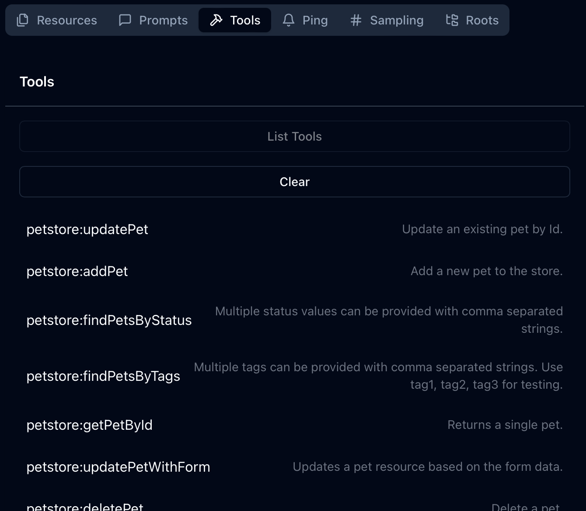
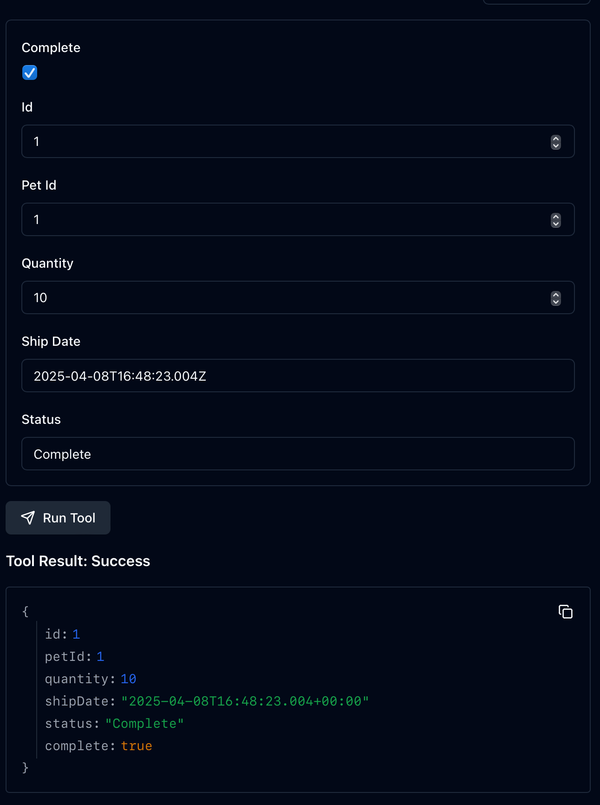

## OpenAPI Example

This example shows how to use the mcp-proxy to proxy a OpenAPI as a MCP service.

OpenAPI is the current backbone of the internet, and it's a great way to describe your API. However, it's not geared towards agentic use-cases. Using mcp-proxy, you can seamlessly integrate OpenAPI APIs into your agentic workflows in a secure and scalable way.

This example will show you how to proxy the [Swagger Petstore](https://petstore3.swagger.io) as the example MCP service.

### Running the example

```bash
cargo run -- -f examples/openapi/config.json
```

This will start the proxy on port 3000. Once it is running we can use the [mcpinspector](https://github.com/modelcontextprotocol/inspector) to try it out.

```bash
npx @modelcontextprotocol/inspector
```

Once the inspector is running, it will present the port that it's running on, and then you can navigate to it in your browser.


Once you're connected, you can navigate to the tools tab and see the available tools.



Let's try out one of the tools, like `placeOrder`.



